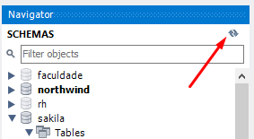

# Project All For One!

This project was developed with a focus on learning how to use the SQL language for queries of different levels of complexity in a restored database.

---

## About the project

This project uses the Northwind database, to restore the database follow the instructions below:

1. Download the backup file [here](northwind.sql) by clicking "Raw", then right clicking and selecting "Save As" to save the file on your computer.
2. Open the file with some text editor, and select the entire contents of the file using `CTRL-A`.
3. Open MySQL Workbench.
4. Open a new query window and paste the entire contents of the `northwind.sql` file into it.
5. Select all the code with the `CTRL-A` shortcut and then click on the lightning bolt icon to run the query.

    
6. Wait a few seconds (wait around 30 seconds before trying to do something).
7. Click on the button shown in the image below to update the database listing.

    
7. Verify that the restored database has all of the following tables:

    
8. Right click on each table and select "Select Rows" and make sure all tables have records. If any are missing, proceed with the next step. Otherwise, you can go to the next section.
9. If there are tables missing, drop the database, right-clicking on the northwind database and selecting "Drop Schema", and redo the steps again, this time waiting for a longer time when running the restoration script .

    

Each file in `./challenges/desafioN.sql` (where N is the challenge number) contains commented the challenge and the SQL code of the resolution.

---

## Technologies used

  * JavaScript
  * SQL

---

## How to run the project

To run the project locally:
1. Clone o repositório
```
$ git clone git@github.com:AlineCarolina/all-for-one.git
```
2. Install dependencies
```
$ npm install
```
Restore the database as previously shown and run the queries of each file to test the project.

---
